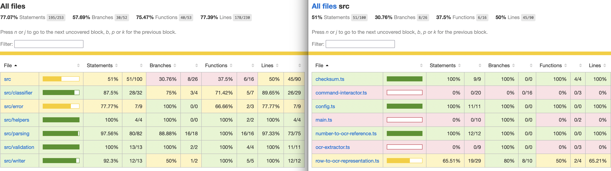
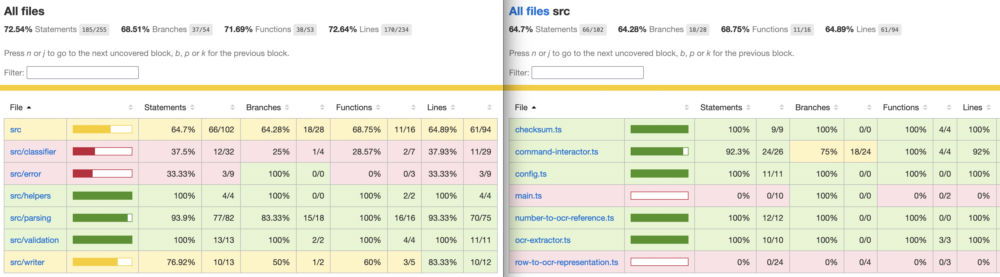

# Improved OCR

## How to use

- firstly add the good shebang to the start of your cli file
- replace {/usr/bin/env npx} by the path of your npx command

```zsh
(echo "#\!/usr/bin/env npx ts-node" && cat src/main.ts) > src/main2.ts && mv src/main2.ts src/main.ts
```

- Secondly give the good right to exec your file

```zsh
chmod +x src/main.ts
```

```zsh
# groued story 1 - 2 - 3 - 4
improve-ocr -f ./errored.txt -f ./clean.txt -f ./unreadable.txt

# single story 5
improve-ocr -f ./file.txt -o ./result.txt -f ./file2.txt -o ./result.txt -f ./file3.txt -o ./result.txt

ts-node src/main.ts -f "test/fixtures/all-digit.txt" -c -f "test/fixtures/complete-entries/two-complete-entries.txt"
```

### Flag usable

- **'-h'** to get help on how to use the application
- **'-c'** to get the output on console
- **'-f'** to select a file to translate
- **'-o'** to select an output file (single classification)

### Manual utilisation

You can run few commands to start/build this app :

- **npm run build** transpile typescript to javascript inside dist folder
- **npm run test** to run the unit test
- **npm run test:inte** to run the integration test (cucumber)
- **npm run cover:unit** to get the coverage of unit testing
- **npm run cover:inte** to get the coverage of integration test (cucumber)
- **npm run lint** to lint the code
- **ts-node src/main.ts** to run the application with typescript

## Test Use Case 1

- test file corresponding: test/parsing.test.ts

## Test Use Case 2

- test file corresponding: test/checksum.test.ts

## Test Use Case 3

- test file corresponding: test/write-code-result.ts

## Test Use Case 4

- test file corresponding: test/write-code-result.ts

## Test Use Case 5

- test file corresponding: test/write-code-result.ts

## Test Use Case 6

- test file corresponding: test/cli.test.ts and cucumber tests

## Test coverage

### Unit test



### Integration test



## Configuration

`config.ts` simplfied
inside `config.ts` you can change and configure the application :

- **OUTPUT_DIR** for the output files in case of groupedClassification
- **DIGIT_WIDTH** and **DIGIT_HEIGHT** for changing the size of the character
- **LINE_NUMBER_DIGIT** for change the length of a line
- **textHelpers** for change the helper text
- **Validator** for remove or add validation constraint
- **argsConfigured** for adding or remove argument

```ts
const OUTPUT_DIR = '';

const DIGIT_WIDTH = 3;
const DIGIT_HEIGHT = 4;
const LINE_NUMBER_DIGIT = 9;
const textHelpers = [..."usage"]
const validators: Map<string, Validator>;
const argsConfigured: Map<CliFunctionnality, string>;
```

### configuration of Graphemes

you can change or add Graphemes inside `number-to-orc-reference.ts`
